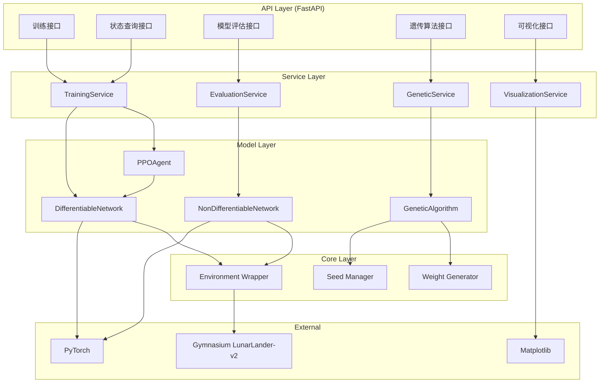
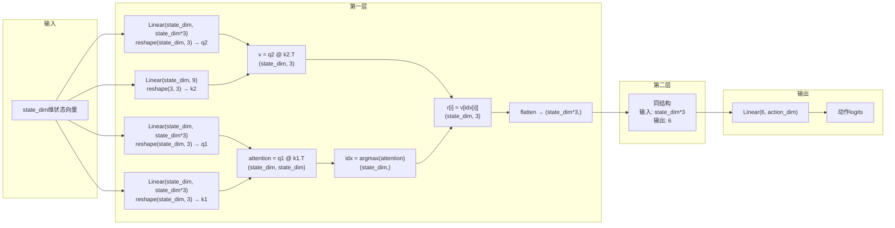
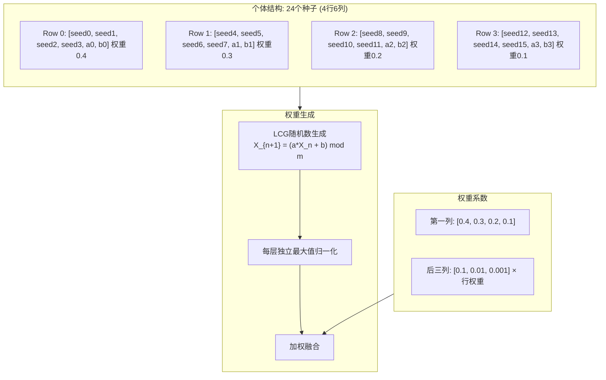
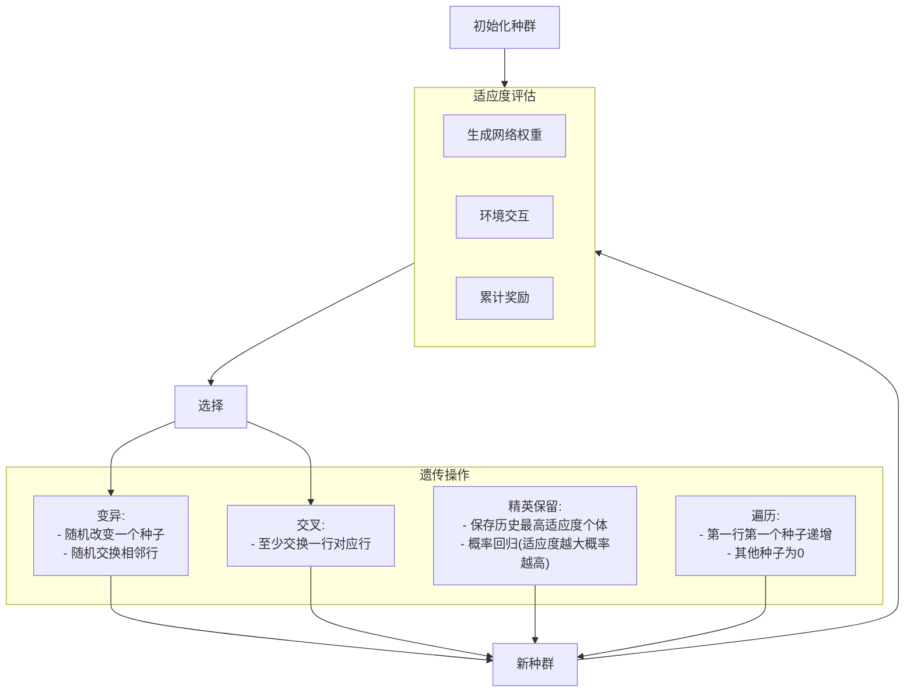
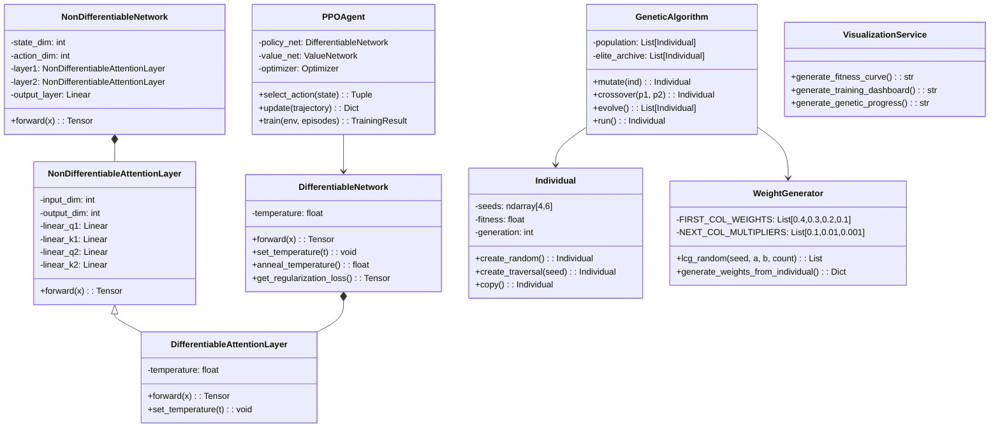

# 项目设计文档 - 不可微神经网络强化学习系统

## 1. 系统架构



## 2. 不可微网络数据流图



## 3. 遗传算法个体结构（4行6列）



## 4. 遗传算法流程



## 5. 类图



## 6. API接口清单

### 6.1 训练管理 (TrainingController)

| Method | Endpoint | Description |
|--------|----------|-------------|
| POST | /api/v1/training/start | 启动PPO训练 |
| GET | /api/v1/training/status/{task_id} | 获取训练状态 |
| POST | /api/v1/training/stop/{task_id} | 停止训练 |
| GET | /api/v1/training/history/{task_id} | 获取训练历史（分页） |
| GET | /api/v1/training/result/{task_id} | 获取训练结果 |
| GET | /api/v1/training/tasks | 列出所有训练任务 |

### 6.2 遗传算法 (GeneticController)

| Method | Endpoint | Description |
|--------|----------|-------------|
| POST | /api/v1/genetic/start | 启动遗传算法搜索 |
| GET | /api/v1/genetic/status/{task_id} | 获取搜索状态 |
| POST | /api/v1/genetic/stop/{task_id} | 停止搜索 |
| GET | /api/v1/genetic/best/{task_id} | 获取最佳个体 |
| GET | /api/v1/genetic/population/{task_id} | 获取当前种群 |
| GET | /api/v1/genetic/tasks | 列出所有任务 |

### 6.3 模型评估 (EvaluationController)

| Method | Endpoint | Description |
|--------|----------|-------------|
| POST | /api/v1/evaluate/run | 运行单次评估 |
| POST | /api/v1/evaluate/seeds | 使用种子评估（24个，4x6） |
| POST | /api/v1/evaluate/compare | 比较可微与不可微网络 |

### 6.4 可视化 (VisualizationController)

| Method | Endpoint | Description |
|--------|----------|-------------|
| GET | /api/v1/visualization/training/{task_id} | 获取训练可视化仪表板 |
| GET | /api/v1/visualization/genetic/{task_id} | 获取遗传算法适应度曲线 |
| GET | /api/v1/visualization/fitness-curve | 生成自定义适应度曲线 |

### 6.5 系统管理 (SystemController)

| Method | Endpoint | Description |
|--------|----------|-------------|
| GET | /api/v1/health | 健康检查 |
| GET | /api/v1/config | 获取系统配置 |

## 7. 核心算法说明

### 7.1 不可微网络的v[idx]实现

```python
# v: [batch, state_dim, 3] - 值矩阵
# idx: [batch, state_dim] - argmax索引结果
# 实现: r[i] = v[idx[i]]，即r的第i行是v的第idx[i]行

# 使用torch.gather实现索引选择
idx_expanded = idx.unsqueeze(-1).expand(-1, -1, 3)
result = torch.gather(v, 1, idx_expanded)

# result: [batch, state_dim, 3]
# flatten后: [batch, state_dim * 3]
```

### 7.2 可微近似 (Softmax Temperature Annealing)

```python
def soft_index_select(v, attention_scores, temperature=1.0):
    """
    使用softmax进行可微近似，通过降低temperature逐渐接近argmax
    
    temperature = 1.0: 完全软选择
    temperature → 0: 逐渐接近硬选择(argmax)
    """
    weights = F.softmax(attention_scores / temperature, dim=-1)
    # weights: [batch, state_dim, state_dim]
    # v: [batch, state_dim, 3]
    result = torch.bmm(weights, v)
    return result

# 温度退火
temperature = max(temperature * decay_rate, min_temperature)
```

### 7.3 同余随机数生成器 (LCG)

```python
def lcg_random(seed: int, a: int, b: int, m: int = 2**31, count: int = 100) -> List[int]:
    """
    线性同余生成器: X_{n+1} = (a * X_n + b) mod m
    
    每行最后两个种子作为a和b
    """
    results = []
    x = seed
    for _ in range(count):
        x = (a * x + b) % m
        results.append(x)
    return results
```

### 7.4 权重融合公式（严格按Prompt）

```
个体结构: 4行6列 = 24个种子

行权重（第一列）: [0.4, 0.3, 0.2, 0.1]

列权重计算:
- 第0列: 行权重[i]
- 第1列: 行权重[i] * 0.1
- 第2列: 行权重[i] * 0.01
- 第3列: 行权重[i] * 0.001
- 第4列: a参数（不参与权重）
- 第5列: b参数（不参与权重）

例如第0行的列权重:
[0.4, 0.04, 0.004, 0.0004, -, -]

例如第1行的列权重:
[0.3, 0.03, 0.003, 0.0003, -, -]

最终权重 = Σ(seed_weight[i,j] * generated_weights[i,j]) / Σ(seed_weight[i,j])
注: seed=0时不生成权重，也不参与加权
```

## 8. 配置参数

### 8.1 PPO参数

| Parameter | Default | Description |
|-----------|---------|-------------|
| learning_rate | 3e-4 | 学习率 |
| gamma | 0.99 | 折扣因子 |
| epsilon | 0.2 | PPO裁剪参数 |
| gae_lambda | 0.95 | GAE参数 |
| ppo_epochs | 10 | 每次更新的epoch数 |
| batch_size | 64 | 批次大小 |
| initial_temperature | 1.0 | 初始温度 |
| temperature_decay | 0.995 | 温度衰减率 |
| min_temperature | 0.01 | 最小温度 |
| regularization_coef | 0.1 | 正则化系数 |

### 8.2 遗传算法参数

| Parameter | Default | Description |
|-----------|---------|-------------|
| population_size | 50 | 种群大小 |
| mutation_rate | 0.1 | 变异率 |
| crossover_rate | 0.7 | 交叉率 |
| elite_size | 5 | 精英保留数量 |
| max_generations | 100 | 最大代数 |
| seed_range | [0, 10000] | 种子范围 |
| target_fitness | 200.0 | 目标适应度（及格线） |

## 9. 环境支持

- 支持任意维度的输入状态（通过state_dim参数配置）
- 输入状态自动归一化（运行时统计均值和标准差）
- 可扩展到其他Gymnasium环境（只需修改env_name参数）
- 默认环境: LunarLander-v2 (state_dim=8, action_dim=4)
